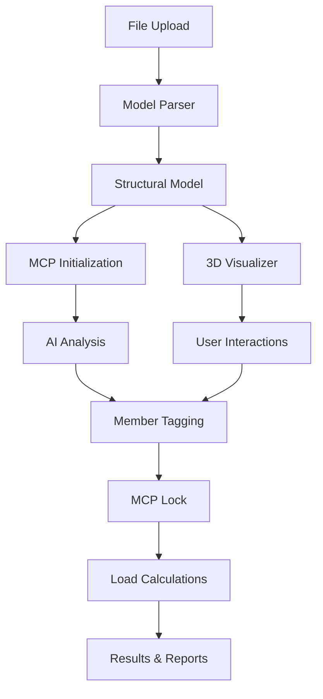

# AZLOAD - Structural Engineering AI Assistant
## Complete Code Structure & Workflow Documentation

### 🏗️ Project Overview
AZLOAD is a web application that parses structural models from STAAD.Pro and SAP2000, visualizes them in 3D, and automatically calculates various loads according to ASCE 7-16 standards.

### 📁 Directory Structure
```
.
├── src/
│   ├── App.tsx                    # Main application component with routing
│   ├── main.tsx                   # Application entry point
│   ├── index.css                  # Global styles
│   ├── vite-env.d.ts             # Vite environment types
│   │
│   ├── components/                # React components
│   │   ├── home.tsx              # Main dashboard with tabs
│   │   ├── model-upload.tsx      # File upload component
│   │   ├── 3d-visualizer.tsx     # 3D model viewer (SVG-based)
│   │   ├── model-analyzer.tsx    # AI analysis & member tagging
│   │   ├── load-parameters.tsx   # Load calculation parameters
│   │   ├── load-results.tsx      # Load calculation results
│   │   ├── report-generator.tsx  # PDF report generation
│   │   ├── project-history.tsx   # Project management
│   │   ├── user-profile.tsx      # User account management
│   │   └── ui/                   # Reusable UI components (shadcn/ui)
│   │       ├── button.tsx
│   │       ├── card.tsx
│   │       ├── tabs.tsx
│   │       └── ... (40+ UI components)
│   │
│   ├── lib/                      # Core business logic
│   │   ├── model-parser.ts       # File parsing (STAAD/SAP2000)
│   │   ├── ai-classifier.ts      # Building type classification
│   │   ├── ai-assistant.ts       # AI prediction engine
│   │   ├── mcp-manager.ts        # Master Control Point manager
│   │   ├── load-calculation.ts   # ASCE 7-16 calculations
│   │   └── utils.ts              # Utility functions
│   │
│   ├── code_engine/              # ASCE 7-16 Implementation
│   │   └── ASCE7_16/
│   │       ├── index.ts          # Main ASCE engine
│   │       ├── chapters/         # Code chapters
│   │       │   ├── wind.ts       # Wind load calculations
│   │       │   ├── seismic.ts    # Seismic load calculations
│   │       │   ├── snow.ts       # Snow load calculations
│   │       │   ├── live.ts       # Live load calculations
│   │       │   ├── dead.ts       # Dead load calculations
│   │       │   └── crane.ts      # Crane load calculations
│   │       └── figures/          # Code figures & tables
│   │           └── index.ts
│   │
│   ├── types/                    # TypeScript definitions
│   │   ├── model.ts              # Structural model types
│   │   └── supabase.ts           # Database types
│   │
│   └── tempobook/                # Tempo platform storyboards
│       ├── dynamic/              # Dynamic components
│       └── storyboards/          # Component demos
│
├── public/                       # Static assets
│   ├── az-logo.png
│   └── azload-logo.png
│
├── package.json                  # Dependencies & scripts
├── vite.config.ts               # Vite configuration
├── tailwind.config.js           # Tailwind CSS config
└── tsconfig.json                # TypeScript config
```

### 🔄 Application Workflow

#### 1. **Application Entry Point**
```typescript
// src/main.tsx
- Initializes React app
- Sets up Tempo devtools
- Renders App component

// src/App.tsx
- Defines routing structure
- Main routes: / (Home), /3d-visualizer (Standalone viewer)
- Integrates Tempo routes for storyboards
```

#### 2. **Main Dashboard Flow**
```typescript
// src/components/home.tsx
┌─────────────────────────────────────────────────────────────┐
│                    AZLOAD Dashboard                         │
├─────────────────────────────────────────────────────────────┤
│ Tabs: Upload | Visualize | Wind | Seismic | Crane |        │
│       Snow | Live | Dead | Dynamic | Reports               │
└─────────────────────────────────────────────────────────────┘

1. Upload Tab:
   - ModelUpload component
   - File validation (STAAD.Pro .std, SAP2000 .s2k)
   - Calls ModelParserFactory.parseFile()
   - Stores model in sessionStorage
   - Initializes MCP (Master Control Point)
   - Auto-switches to Visualize tab

2. Visualize Tab:
   - ThreeDVisualizer component (embedded)
   - ModelAnalyzer component (AI analysis)
   - MCP status panel
   - Quick action buttons for load calculations

3. Load Calculation Tabs (Wind, Seismic, etc.):
   - LoadParameters component
   - ASCE 7-16 parameter configuration
   - Calls LoadCalculationEngine methods
   - Results passed to Reports tab

4. Reports Tab:
   - LoadResults component
   - PDF report generation
   - Model export functionality
```

#### 3. **File Parsing Workflow**
```typescript
// src/lib/model-parser.ts

ModelParserFactory.parseFile(file)
├── readFileContent(file) → string
├── new RawFileParser(content, filename)
└── parseToModel() → StructuralModel
    ├── detectFileType() → "STAAD" | "SAP2000"
    ├── extractNodes() → Node[]
    │   └── Pattern: /^\s*(\w+)\s+([\d.\-e+]+)\s+([\d.\-e+]+)\s+([\d.\-e+]+)/
    ├── extractMembers() → Member[]
    │   └── Pattern: /^\s*(\w+)\s+(\w+)\s+(\w+)(?:\s|$)/
    └── calculateGeometry() → ModelGeometry
        ├── Calculate coordinate ranges (min/max X,Y,Z)
        ├── Derive building dimensions
        └── Calculate member lengths
```

#### 4. **3D Visualization Workflow**
```typescript
// src/components/3d-visualizer.tsx

ThreeDVisualizer Component
├── Load model from sessionStorage
├── Initialize Simple3DProjector
├── SVG3DViewer Component
│   ├── Project 3D coordinates to 2D screen
│   ├── Render nodes as circles
│   ├── Render members as lines
│   ├── Apply color coding (member tags/types)
│   └── Handle mouse interactions (rotate, zoom, select)
├── Control Panel
│   ├── Model information display
│   ├── Color legend
│   ├── Selection details
│   └── Member tag editor
└── MCP integration for tag updates

Projection Pipeline:
3D World Coords → Rotation → Perspective → 2D Screen Coords
```

#### 5. **AI Analysis Workflow**
```typescript
// src/components/model-analyzer.tsx
// src/lib/ai-assistant.ts
// src/lib/ai-classifier.ts

AI Analysis Pipeline:
1. AIAssistant.generatePredictions(model)
   ├── Building type classification
   ├── Member tag predictions
   └── Rule-based validation

2. User Review & Feedback
   ├── Display AI predictions
   ├── Allow manual corrections
   └── Collect user satisfaction ratings

3. MCP Integration
   ├── Apply confirmed predictions to MCP
   ├── Lock MCP for calculations
   └── Update model with tags

Fallback: AIBuildingClassifier (legacy)
├── classifyBuilding() → BuildingType
├── tagMembers() → MemberTag mapping
└── validateTags() → Validation results
```

#### 6. **Master Control Point (MCP) Workflow**
```typescript
// src/lib/mcp-manager.ts

MCP Lifecycle:
1. Initialize from uploaded model
   ├── Extract geometry data
   ├── Classify building characteristics
   ├── Set default parameters
   └── Create validation rules

2. AI Analysis Integration
   ├── Apply AI predictions
   ├── Update member tags
   ├── Validate consistency
   └── Generate warnings/errors

3. Lock for Calculations
   ├── Validate all required data
   ├── Freeze configuration
   ├── Enable load calculations
   └── Prevent further modifications

4. Export Capabilities
   ├── exportToSTAAD() → STAAD.Pro format
   ├── exportToSAP2000() → SAP2000 format
   └── Generate calculation reports
```

#### 7. **Load Calculation Workflow**
```typescript
// src/components/load-parameters.tsx
// src/lib/load-calculation.ts
// src/code_engine/ASCE7_16/

Load Calculation Pipeline:
1. Parameter Configuration
   ├── Load type selection (Wind, Seismic, etc.)
   ├── ASCE 7-16 parameter input
   ├── MCP data integration
   └── Validation checks

2. Calculation Engine
   ├── LoadCalculationEngine.calculateWindLoads()
   ├── LoadCalculationEngine.calculateSeismicLoads()
   ├── ... (other load types)
   └── Return LoadCalculationResult[]

3. ASCE 7-16 Implementation
   ├── Wind: Chapters 27-30
   ├── Seismic: Chapters 11-16
   ├── Snow: Chapter 7
   ├── Live: Chapter 4
   ├── Dead: Chapter 3
   └── Crane: Section 4.9

4. Results Processing
   ├── Apply loads to model
   ├── Update 3D visualization
   ├── Generate calculation reports
   └── Export to original formats
```

### 🎯 Key Data Flow



### 🔧 Core Technologies

- **Frontend**: React 18 + TypeScript + Vite
- **UI Framework**: Tailwind CSS + shadcn/ui
- **3D Visualization**: Custom SVG-based renderer
- **State Management**: React hooks + Context
- **File Processing**: Custom parsers for STAAD/SAP2000
- **AI/ML**: Custom classification algorithms
- **Database**: Supabase (PostgreSQL)
- **Development**: Tempo platform integration

### 📊 Data Models

```typescript
// Core Types (src/types/model.ts)

StructuralModel {
  id: string
  name: string
  type: "STAAD" | "SAP2000"
  nodes: Node[]           // 3D coordinates
  members: Member[]       // Connectivity
  geometry: ModelGeometry // Calculated dimensions
  buildingType?: BuildingType
  aiDetection?: AIDetection
}

MasterControlPoint {
  buildingType: BuildingType
  dimensions: BuildingDimensions
  memberTags: MemberTagAssignment[]
  validation: ValidationResult
  isLocked: boolean
  unitsSystem: "METRIC" | "IMPERIAL"
}

LoadCalculationResult {
  loadType: LoadType
  parameters: LoadParameters
  appliedLoads: AppliedLoad[]
  calculations: CalculationStep[]
  codeReferences: CodeReference[]
}
```

### 🚀 Development Workflow

1. **Local Development**
   ```bash
   npm run dev          # Start development server
   npm run build        # Build for production
   npm run types:supabase # Update database types
   ```

2. **Tempo Platform Integration**
   - Storyboards for component development
   - Visual canvas for UI design
   - Real-time code synchronization

3. **File Processing Pipeline**
   - Upload → Parse → Validate → Visualize → Analyze → Calculate

4. **Quality Assurance**
   - TypeScript for type safety
   - Component-based architecture
   - Comprehensive error handling
   - User feedback integration

This structure provides a complete end-to-end workflow for structural engineering analysis, from file upload to professional report generation, with AI-powered automation and comprehensive ASCE 7-16 compliance.